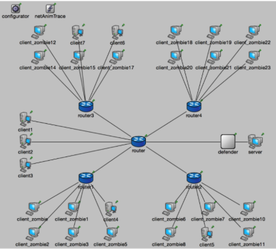

# DDoS attack and basic defense mechanism simulation in Omnet++ 4.6

## Instructions (English)
This code is intended for [Omnet++ 4.6](https://github.com/omnetpp/omnetpp/releases/download/omnetpp-4.6/omnetpp-4.6-src.tgz).

To run the simulator, follow these steps:
- in `inet` package source code, substitute the provided `pingapp/` and `tcpapp/` folders in original applications paths:
  -   `pingapp/` -> `$OMNETPP_WORKSPACE/inet/src/applications/pingapp/`
  -   `tcpapp/` -> `$OMNETPP_WORKSPACE/inet/src/applications/tcpapp/`
- import project `DDoS46/` inside Omnet++ 4.6;

## Istruzioni (Italiano)

Questo codice si intende per [Omnet++ 4.6](https://github.com/omnetpp/omnetpp/releases/download/omnetpp-4.6/omnetpp-4.6-src.tgz).

Per eseguire correttamente il simulatore, procedere con i seguenti passi:
- sostituire nei sorgenti di inet i file contenuti nelle cartelle `pingapp/` e `tcpapp/`, rispettivamente nei percorsi `$OMNETPP_WORKSPACE/inet/src/applications/pingapp/` e `$OMNETPP_WORKSPACE/inet/src/applications/tcpapp/`;
- importare il progetto `DDoS46/` all'interno di Omnet++ 4.6;
